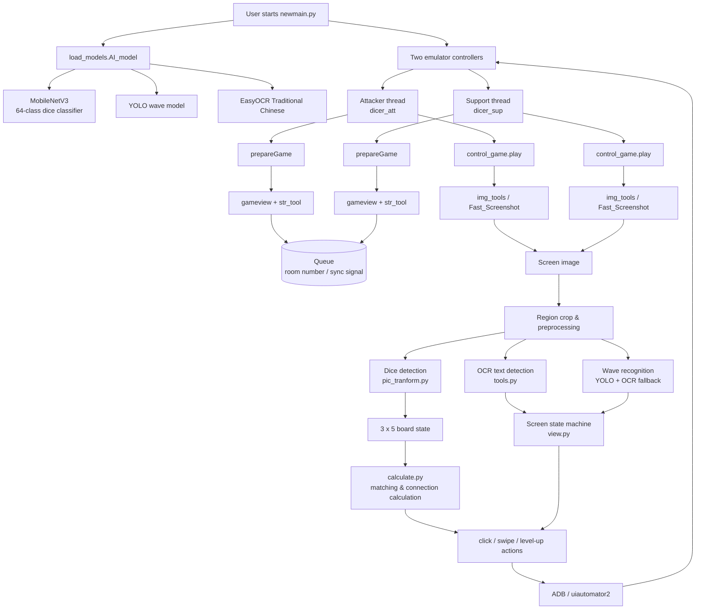

# Yinyun Auto Play RandomDice

> 基於電腦視覺、深度學習與 Android 自動化的《Random Dice》陰陽協同自動控制系統。

本專案將兩個 Android Emulator 視為可被觀測與控制的遊戲裝置，透過螢幕截圖理解遊戲狀態，再自動執行房間建立、加入房間、召喚骰子、骰子移動、合成、升級與結算等操作。

它不依賴遊戲內部 API，而是建立一個「**畫面擷取 → 視覺辨識 → 狀態判斷 → 策略計算 → UI 操作**」的閉環自動化流程，展示 Computer Vision、Deep Learning、OCR、Android UI Automation 與多執行緒協同控制的整合能力。

## Features

- **骰子視覺辨識**：使用 PyTorch / MobileNetV3 分類盤面中的骰子種類與等級。
- **盤面建模**：將遊戲盤面抽象成 `3 × 5 × 2` 的矩陣，分別記錄骰子類型與骰子點數／等級。
- **遊戲文字辨識**：使用 EasyOCR 辨識波次、房號、按鈕與畫面提示文字。
- **狀態機控制**：根據畫面關鍵字判斷目前處於主畫面、合作模式、房間等待、遊戲中、網路錯誤或結算畫面。
- **雙裝置協同**：同時控制攻擊方與輔助方兩個 Emulator，使用 Threading 與 Queue 傳遞房號及同步訊號。
- **自動策略操作**：依照盤面上的骰子位置、種類與等級，尋找可行的移動與合成連線。
- **多層容錯**：主要模型辨識失敗時，波次與文字流程可退回 OCR 或其他畫面判斷邏輯。
- **快速截圖**：支援透過 ADB 截圖，以及從 Windows Emulator 視窗擷取畫面。

## System Architecture



### Runtime loop

1. 啟動兩個 Android Emulator，並透過 ADB 連線。
2. `newmain.py` 載入骰子分類模型、波次模型與 EasyOCR。
3. 攻擊方建立合作房間，將房號透過 `Queue` 傳給輔助方。
4. 兩個控制流程擷取當前畫面，切割關鍵區域並進行辨識。
5. `view.py` 根據 OCR 結果判斷畫面狀態。
6. `pic_tranform.py` 將骰子辨識結果轉換成盤面狀態。
7. `calculate.py` 根據骰子類型、等級與位置計算合成連線。
8. `control_game.py` 將決策轉換成點擊、滑動、召喚與升級動作。
9. 持續執行直到偵測到結算畫面或返回主畫面。

## Project Structure

```text
.
├── newmain.py                 # 主要執行入口；啟動雙 Emulator 協同流程
├── control_game.py            # 遊戲中盤面辨識、策略與操作控制
├── PrepareGame.py             # 啟動遊戲、建立／加入合作房間
├── view.py                    # 根據 OCR 結果判斷畫面狀態
├── calculate.py               # 盤面元素搜尋與骰子連線／合成計算
├── load_models.py             # 載入 MobileNetV3、YOLO 與 EasyOCR
├── model.py                   # 自訂骰子分類模型定義
├── pic_tranform.py            # 影像轉換、批次分類與骰子結果解析
├── predict.py                 # 影像資料批次分類工具
├── tools.py                   # OCR、座標點擊與影像工具
├── Tools/
│   ├── adb_tool.py            # ADB 連線、輸入與裝置尺寸取得
│   └── Img_tool.py            # 截圖、裁切與模板匹配
├── Fast_Screenshot/           # Windows Emulator 視窗快速截圖
├── V3model_epoch_8.pth        # 骰子分類模型權重
├── wave.pt                    # 波次辨識模型權重
├── best_sup.pt                # 輔助方模型權重
└── requirements.txt           # Python dependencies
```

## Tech Stack

| Category | Technologies |
| --- | --- |
| Language | Python |
| Deep Learning | PyTorch, Torchvision, MobileNetV3, Ultralytics YOLO |
| Computer Vision | OpenCV, Pillow, template matching |
| OCR | EasyOCR（繁體中文） |
| Android Automation | ADB, adbutils, uiautomator2 |
| Concurrency | Threading, multiprocessing.Queue |
| Runtime | Windows + Android Emulator |

## Installation

> 本專案是針對個人 Android Emulator 環境開發的研究與自動化實作。由於遊戲畫面座標、視窗名稱與模型權重具有環境相依性，執行前需要依照自己的裝置設定調整參數。

### Requirements

- Windows
- Python 3.8+（原始開發環境使用 Python 3.8）
- Android Emulator（例如 BlueStacks）
- ADB 已加入 PATH
- 可用的 CPU 或 CUDA GPU
- 已下載本 repository 內的模型權重

### Setup

```bash
git clone https://github.com/Eric25741629/yinyun_auto_play_randomdice.git
cd yinyun_auto_play_randomdice
python -m venv .venv
.venv\Scripts\activate
pip install -r requirements.txt
```

若使用 Conda：

```bash
conda create -n randomdice python=3.8
conda activate randomdice
pip install -r requirements.txt
```

### Emulator setup

1. 啟動兩個 Android Emulator instance。
2. 確認 ADB 可以找到裝置：

```bash
adb devices
```

3. 檢查 `newmain.py` 中的視窗名稱與 ADB device address，例如：

```python
# example only
('BlueStacks App Player', '127.0.0.1:5555')
('BlueStacks App Player 1', '127.0.0.1:5565')
```

4. 確認裝置內已安裝對應遊戲，且畫面解析度與程式使用的座標系統相容。

## Usage

```bash
python newmain.py
```

程式會建立攻擊方與輔助方兩個控制執行緒，並依照遊戲畫面自動完成合作流程。

### Important configuration points

- `newmain.py`：調整 Emulator 視窗名稱、ADB 位址與雙角色啟動流程。
- `load_models.py`：調整模型權重路徑、推論裝置與 EasyOCR GPU 設定。
- `control_game.py`：調整盤面座標、角色策略與操作流程。
- `Tools/Img_tool.py`：調整截圖來源、視窗擷取與解析度處理。
- `requirements.txt`：依照實際 CUDA、PyTorch 與 OpenCV 版本修正套件版本。

## Design Highlights

### 1. From pixels to actions

系統不直接讀取遊戲內部資料，而是從畫面推論狀態。這使它具備類似 RPA 與視覺代理人的架構：

```text
Screenshot
   ↓
Region of Interest cropping
   ↓
Dice classifier / OCR / wave detector
   ↓
Structured game state
   ↓
Board matching and decision logic
   ↓
ADB click / swipe actions
```

### 2. Confidence-aware recognition

骰子分類流程會計算模型輸出的機率，低於信心門檻的結果不直接當作有效骰子，避免錯誤辨識進一步造成錯誤操作。對文字及波次辨識則保留 OCR fallback，形成多模型協作的辨識流程。

### 3. Multi-device synchronization

攻擊方負責建立合作房間並透過 Queue 傳遞房號；輔助方讀取房號後加入房間。進入遊戲後，兩個角色依照不同職責執行各自策略，展現多裝置協同與非同步控制能力。

## Limitations

- 目前依賴特定遊戲版本、畫面解析度、Emulator 視窗名稱與座標配置。
- 模型權重與遊戲畫面具有環境相依性，換裝置後可能需要重新調整或訓練。
- Repository 目前未提供完整的自動化測試與正式 benchmark；使用時應自行驗證辨識準確率與長時間穩定性。
- `requirements.txt` 中部分深度學習與影像套件版本可能需要依照本機 CUDA／Python 環境調整。
- 本專案僅供個人研究、電腦視覺與 UI 自動化學習使用，請遵守相關遊戲服務條款。

## Future Improvements

- 將畫面座標與裝置設定改為 YAML／JSON 設定檔。
- 增加辨識準確率、推論延遲與連續運行時間等 benchmark。
- 將模型權重改由 Git LFS 或 Release 管理。
- 補充單元測試、模擬畫面測試與錯誤恢復機制。
- 將角色策略與底層裝置控制進一步解耦，方便支援不同遊戲模式與解析度。
- 增加執行紀錄、截圖 debug mode 與操作回放功能。

## Resume Value

這個專案可展示以下能力：

- Computer Vision 與影像前處理
- PyTorch 模型推論與模型信心判斷
- OCR 與非結構化畫面理解
- Android Emulator 與 UI Automation
- 狀態機設計與錯誤 fallback
- 盤面資料建模與匹配演算法
- 多執行緒、多裝置協同控制
- 從感知、決策到執行的端到端系統整合

## License

本 repository 目前未指定正式開源授權。若要公開供他人使用，建議補上適合的 LICENSE，並確認模型權重與相關素材的使用權限。

## Documentation and examples

- [System architecture](docs/architecture.md) — 元件分層與資料流架構圖。
- [System flow](docs/system-flow.md) — 雙 Emulator 協同的 sequence diagram。
- [Model recognition example](docs/model-example.md) — 骰子影像分類與盤面轉換流程。
- [Benchmark protocol](docs/benchmark.md) — 準確率、拒絕率、推論延遲與穩定性量測規範。
- [Demo recording guide](docs/demo.md) — 實機 Demo 錄製與敏感資訊遮蔽規範。

## Demo

本專案提供實機操作影片：**[觀看 Demo：PyTorch + uiautomator2 自動決策 Random Dice](https://www.youtube.com/watch?v=iudArQcVxY0)**。影片展示以 PyTorch 與 Android automation 為核心的自動決策流程；影片長度約 39 分 45 秒。


## Model recognition example

目前文件已提供完整的模型推論流程與輸出格式；若要展示實際辨識效果，請加入不含個資的遊戲截圖、ROI 標註、預測類別、confidence 與盤面矩陣。詳細格式請參考 Model Recognition Example。

## Testing and error handling

執行測試：python -m pytest -q

目前測試涵蓋盤面元素搜尋、距離計算與連線計算等純函式邏輯。影像辨識與 Android Emulator 流程需要實際模型、裝置與畫面，建議另以錄製截圖或 mock device 建立 integration tests。

錯誤處理策略：模型信心不足時回傳 unknown；波次辨識失敗時退回 OCR；OCR 未讀到文字時避免誤判畫面；ADB 操作捕捉例外並輸出 debug 資訊；房號 Queue 傳遞設有等待與 timeout。

## Model files and Git LFS

大型模型權重使用 Git LFS 管理。執行 git lfs install 與 git lfs pull 下載模型，並使用 git lfs ls-files 確認追蹤狀態。模型權重、訓練資料與遊戲素材公開前，請確認授權條件。

