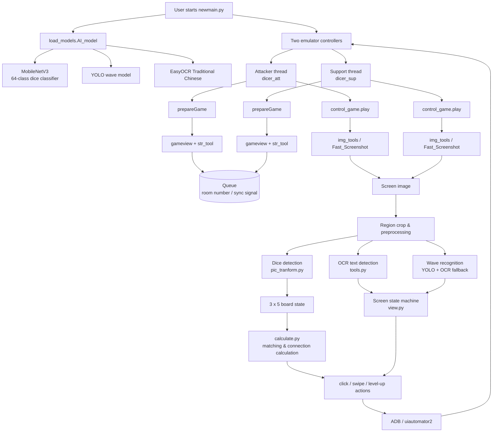

# System Architecture



## Data flow

```text
Android Emulator
      │
      ▼
Screenshot capture (ADB / Windows window capture)
      │
      ▼
ROI crop + image preprocessing
      │
      ├── MobileNetV3 → dice type / level
      ├── EasyOCR     → UI text / room number / buttons
      └── YOLO        → wave number
      │
      ▼
Structured game state + 3×5 board matrix
      │
      ▼
State machine + matching / connection calculation
      │
      ▼
ADB / uiautomator2 click, swipe, launch, input
```
