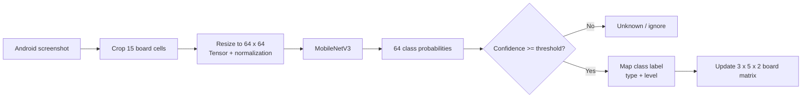

# Model Recognition Example

## Recognition pipeline



## Output representation

每個盤面格子會轉換成兩個欄位：

```python
place[row][column][0]  # dice type
place[row][column][1]  # dice level / pip value
```

模型輸出會經過 confidence threshold；低信心結果會標記為 `(-1, -1)`，避免把不確定的影像直接傳給策略模組。

## How to add a real example

請將一張不含帳號、房號或其他個人資訊的遊戲截圖放在 `docs/assets/`，並在此加入：

- 原始盤面截圖
- 15 個 ROI crop 或標註框
- 模型預測類別與 confidence
- 實際盤面矩陣
- 是否正確的人工標記

目前 repository 只有零散的圖片素材，尚未包含可公開展示的完整「原圖 → 預測結果」範例，因此不在文件中捏造辨識結果。
