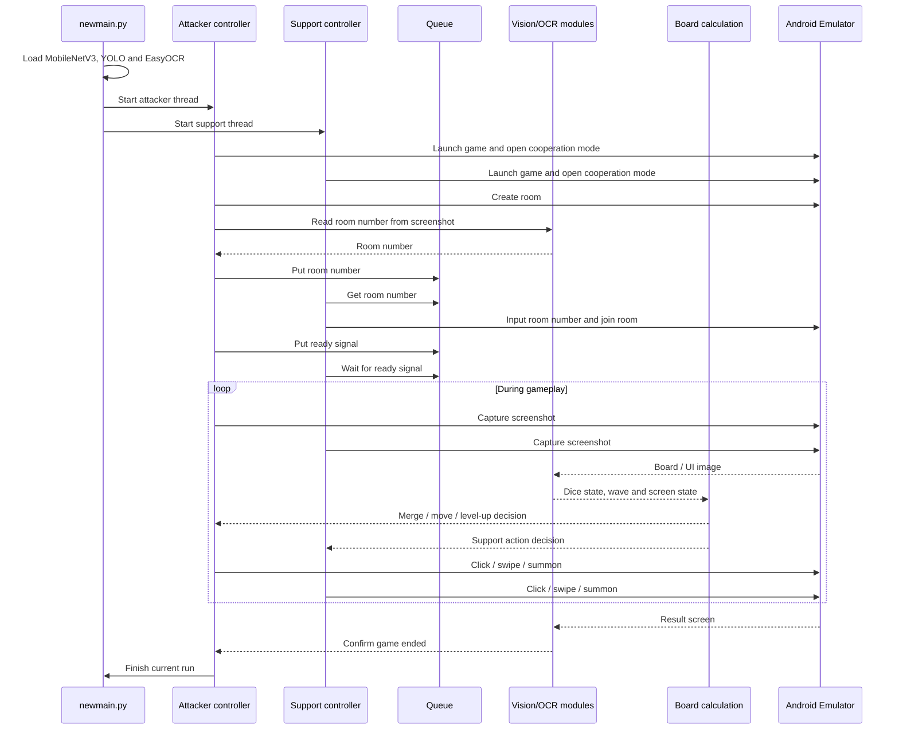

# System Flow

```mermaid
sequenceDiagram
    participant Main as newmain.py
    participant Att as Attacker controller
    participant Sup as Support controller
    participant Queue as Queue
    participant Vision as Vision/OCR modules
    participant Calc as Board calculation
    participant Device as Android Emulator

    Main->>Main: Load MobileNetV3, YOLO and EasyOCR
    Main->>Att: Start attacker thread
    Main->>Sup: Start support thread
    Att->>Device: Launch game and open cooperation mode
    Sup->>Device: Launch game and open cooperation mode
    Att->>Device: Create room
    Att->>Vision: Read room number from screenshot
    Vision-->>Att: Room number
    Att->>Queue: Put room number
    Sup->>Queue: Get room number
    Sup->>Device: Input room number and join room
    Att->>Queue: Put ready signal
    Sup->>Queue: Wait for ready signal
    loop During gameplay
        Att->>Device: Capture screenshot
        Sup->>Device: Capture screenshot
        Device-->>Vision: Board / UI image
        Vision-->>Calc: Dice state, wave and screen state
        Calc-->>Att: Merge / move / level-up decision
        Calc-->>Sup: Support action decision
        Att->>Device: Click / swipe / summon
        Sup->>Device: Click / swipe / summon
    end
    Device-->>Vision: Result screen
    Vision-->>Att: Confirm game ended
    Att->>Main: Finish current run
```

